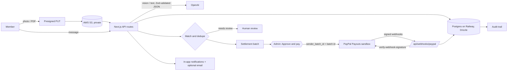

# SettleShort

**Receipt in. Settled out. One approve.**

SettleShort turns receipt photos, PDFs and messages like "I paid ₹2,400 for team dinner, split with Asha and Ravi" into expense claims, catches duplicates, and reimburses each person through **PayPal Payouts**, but only after one human admin clicks Approve. No money moves without it.

Built for small teams and the ops or finance person who settles shared expenses, for the [PayPal "Build What's Next with PayPal and AI" hackathon](https://paypalaihackathon.devpost.com/).

## Try it

**One click:** open the app and click **Open the demo** (`/demo`). You get a fresh, private "Northbeam Labs" workspace signed in as Maya (owner/admin), with sample receipts, a suspected duplicate and a batch waiting for approval.

**Demo logins** (after `pnpm db:seed`; password is `DEMO_PASSWORD`, default `settleshort-demo`):

| Role | Email |
| --- | --- |
| Admin (approves and pays) | `maya@demo.settleshort.app` |
| Member (submits claims) | `sam@demo.settleshort.app` |
| Member (submits claims) | `rita@demo.settleshort.app` |

The loop in under a minute:

1. **Claims > New claim**: pick a sample receipt or paste a message. Each field is read with the exact receipt text it came from; uncertain fields are highlighted for a human.
2. The duplicate check runs. A look-alike claim shows as "possible duplicate" side by side; nothing is merged automatically.
3. **Batches > September offsites > Approve & Pay**: see who gets paid, how much, and to which PayPal address; type `APPROVE`.
4. Statuses move to Paid with PayPal item and transaction ids. **Notifications** tells each payee; **Activity** has the full audit trail.

## Architecture



- **Intake.** Images and PDFs go browser -> S3 through a 5 minute presigned PUT URL that signs the key, type and exact size. The server re-reads the object, checks the key belongs to the caller's workspace and claim, checks file signatures, then extracts. Messages are parsed as text.
- **AI (OpenAI).** Vision for receipts and PDFs, text for messages. Output is JSON validated with Zod: merchant, amount (integer minor units), currency, date, payer, people owed, and per-field confidence. Low confidence or missing fields send the claim to review with those fields highlighted. The AI never invents a PayPal email; payees without one are asked for it. Receipt text is untrusted data and can only fill fields. With no key, an on-device OCR + parser runs instead; `ANTHROPIC_API_KEY` is an optional alternative.
- **Matching.** Rules first: same currency, amount within 1%, dates within 3 days, similar merchant, same or overlapping payer. Ambiguous matches ask a human. Exact same file is refused.
- **Approve gate.** Admin (owner/admin role) with release authority, typed confirmation, per-payout and per-batch caps, changed-since-approval checks, verified PayPal receivers. Who approved and when is stored on the batch and in the audit log.
- **Payouts.** `approveBatch` in `src/lib/batches.ts` is the only code path that moves money. An atomic `awaiting_approval -> submitting` flip plus `sender_batch_id = batch id` and a `PayPal-Request-Id` header make a double click pay once. Unknown outcomes (timeouts) lock claims until replay-verified.
- **Webhooks.** `POST /api/webhooks/paypal` verifies every event with PayPal's verify-webhook-signature API and `PAYPAL_WEBHOOK_ID`, rejects unverified ones, and applies item SUCCEEDED / FAILED / UNCLAIMED / RETURNED / BLOCKED. Batches also have a **Refresh status** fallback that polls PayPal once.
- **Notifications.** In-app list always. Email through Nodemailer only when all SMTP vars are set; otherwise skipped with one log line.

### Where PayPal is used
- `POST /v1/oauth2/token`: client credentials, token cached until shortly before expiry
- `POST /v1/payments/payouts`: one batch per approval
- `GET /v1/payments/payouts/{id}`: refresh-status fallback
- `POST /v1/notifications/verify-webhook-signature`: before any webhook is trusted

**Sandbox only.** The live API host is refused at startup and at module load. Without `PAYPAL_CLIENT_ID`/`SECRET` a clearly labelled payout simulator runs and every screen says so.

### Data model
Table names in the code vs the product vocabulary: `workspaces` = teams, `memberships` (role `owner` / `admin` / `member`), `claims`, `claim_splits` = claim shares, `claim_evidence` = receipts (S3 key, mime, name, hash), `ai_jobs` + `claims.ai_json` = extractions (raw JSON, confidence), `batches` = payout batches, `batch_items` = payout items, `audit_events`, `sessions`, `notifications`. Amounts are integer cents everywhere.

### Auth
Local email + password. Passwords are hashed with bcrypt. Sessions are rows in Postgres; the httpOnly, `secure` (in production), `sameSite=lax` cookie holds a random token and the database stores only an HMAC of it keyed by `SESSION_SECRET`. Every API route resolves the user and workspace from the session server-side and re-checks membership; a workspace id from the client is never trusted.

## Run locally

```bash
pnpm i
cp .env.example .env.local      # set DATABASE_URL and SESSION_SECRET at minimum
aws configure                    # once: the app uses the AWS SDK default credential chain
pnpm db:migrate
pnpm db:seed                     # fixed demo team + logins above
pnpm dev
```

Open http://localhost:3000. Env is validated at server start (`src/lib/env.ts`): a missing or half-set integration fails with a message naming each variable.

**Tests:** `pnpm test`. Set `TEST_DATABASE_URL` to an empty Postgres database to also run the end-to-end approve-and-pay test (PayPal mocked); CI does this with a Postgres service.

### S3 setup
Private bucket, Block Public Access on. Objects live at `receipts/{workspaceId}/{claimId}/{uuid}.{ext}`. Viewing redirects to a 5 minute presigned GET after a team check.

IAM policy for the credentials the SDK finds:

```json
{
  "Version": "2012-10-17",
  "Statement": [
    { "Effect": "Allow", "Action": ["s3:PutObject", "s3:GetObject", "s3:DeleteObject"], "Resource": "arn:aws:s3:::YOUR_BUCKET/receipts/*" }
  ]
}
```

Bucket CORS (needed for browser presigned PUT):

```json
[
  {
    "AllowedOrigins": ["https://YOUR-APP.vercel.app", "http://localhost:3000"],
    "AllowedMethods": ["PUT", "GET"],
    "AllowedHeaders": ["Content-Type"],
    "ExposeHeaders": ["ETag"],
    "MaxAgeSeconds": 3000
  }
]
```

### PayPal sandbox setup
1. developer.paypal.com > Apps & Credentials > Sandbox > create an app; copy Client ID and Secret.
2. Testing tools > Sandbox accounts: one Business account (sender, funded) and a few Personal accounts (receivers).
3. Put the personal emails in `DEMO_PAYPAL_RECEIVERS`, or on each member under Members.
4. Add a webhook to `https://YOUR-APP.vercel.app/api/webhooks/paypal` for `PAYMENT.PAYOUTSBATCH.*` and `PAYMENT.PAYOUTS-ITEM.*`; copy its id into `PAYPAL_WEBHOOK_ID`.

## Deploy (Vercel + Railway)

1. **Railway:** create a Postgres service; copy its public connection URL into `DATABASE_URL`. Run `pnpm db:migrate` and `pnpm db:seed` against it once.
2. **Vercel:** import the repo (framework Next.js) and add these env vars:

| Variable | Required | Notes |
| --- | --- | --- |
| `DATABASE_URL` | yes | Railway Postgres URL |
| `SESSION_SECRET` | yes | `openssl rand -hex 32` |
| `NEXT_PUBLIC_APP_URL` | yes | e.g. `https://YOUR-APP.vercel.app`, used in email links |
| `OPENAI_API_KEY` | for AI | without it, on-device OCR runs |
| `PAYPAL_CLIENT_ID`, `PAYPAL_CLIENT_SECRET` | for real sandbox payouts | without them, the simulator runs |
| `PAYPAL_API_BASE` | yes with PayPal | `https://api-m.sandbox.paypal.com` |
| `PAYPAL_WEBHOOK_ID` | yes with PayPal | from the webhook you register |
| `AWS_REGION`, `S3_BUCKET_NAME` | for uploads | |
| `AWS_ACCESS_KEY_ID`, `AWS_SECRET_ACCESS_KEY` | for uploads | read by the AWS SDK, never by app code |
| `SMTP_HOST`, `SMTP_PORT`, `SMTP_USER`, `SMTP_PASS`, `MAIL_FROM` | optional | Gmail: `smtp.gmail.com`, `465`, app password |
| `CRON_SECRET` | optional | protects the daily escalation cron |
| `DEMO_PAYPAL_RECEIVERS`, `DEMO_PAYPAL_SENDER` | optional | sandbox accounts used by `/demo` |

3. Register the PayPal webhook at `https://YOUR-APP.vercel.app/api/webhooks/paypal`.

## API
All under `/api/v1` unless noted, JSON, session cookie auth, errors as `{ error: { code, message } }`.

| Method | Path | Notes |
| --- | --- | --- |
| POST | `/claims/upload-url` | `{ mime, size }` -> presigned PUT `{ url, key, headers }` (JPEG/PNG/WebP/PDF, 10MB) |
| POST | `/claims/upload` | `{ key, name }` after the PUT; extracts and creates the claim |
| POST | `/claims/:id/evidence/upload-url`, `/claims/:id/evidence` | attach more files `{ key, name, kind }` or text `{ text }` |
| POST | `/claims/from-text` | `{ text }` |
| GET | `/claims?status=&q=` | |
| GET / PATCH | `/claims/:id` | edit fields, `markReady` (admin) |
| GET | `/claims/:id/receipt` | 302 to a 5 minute presigned S3 URL |
| POST | `/claims/:id/reject` | admin |
| POST | `/claims/merge` | `{ ids }`, admin |
| GET / POST | `/batches` | create from ready claims, admin |
| GET | `/batches/:id` | |
| POST | `/batches/:id/approve` | `{ confirm: "APPROVE" }`, admin, the only payout trigger |
| POST | `/batches/:id/refresh-status` | poll PayPal once |
| GET | `/batches/:id/export` | CSV |
| POST | `/api/webhooks/paypal` | signature verified (also at `/api/v1/webhooks/paypal`) |
| POST | `/webhooks/zapier` | header `x-settleshort-secret` |
| GET | `/health` | |

## Stack
Next.js 16 (App Router), TypeScript, Tailwind CSS 4, Drizzle ORM, Postgres (postgres-js; Railway), AWS S3 (SDK v3), AG Grid Community (claims and payout batches), OpenAI, PayPal REST, Nodemailer, bcrypt, Zod, Vitest.

## License
[MIT](LICENSE)
